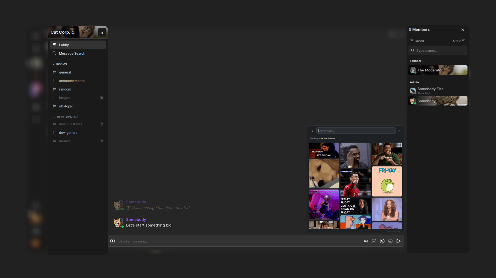

 

  

  <h3 align="center">Wingspan</h3>

  

    Extend the functionality of any cinny client!
     

 <a href="https://chrome.google.com/webstore/detail/cgmkamiajocdlgedobmgnppipejcmech">Get From Chrome Store</a>
    •
 <a href="https://github.com/LuckLATL/wingspan/issues">Report Bug</a>

# About

  

Wingspan is a Chrome and Firefox extension designed to expand the functionality of the Matrix Client Cinny. As Cinny already provides a lot of functionality but is lacking some important features, such as presence dots. Wingspan adds these features in the form of a browser extension.

## Features

| Feature | Details |
|---|---|
| **GIF Picker** | Integrated button in the Cinny composer toolbar |
| **Live Search** | Debounced search-as-you-type via the Klipy API |
| **Trending Feed** | Opens to trending GIFs by default |
| **Favorites** | Save GIFs with ♥ |
| **Masonry Grid** | 3-column layout that respects each GIF's natural height |
| **Animated Previews** | Picker thumbnails play as animated GIFs, not static stills |
| **Native Attachments** | GIFs upload to your homeserver as `m.image` events |
| **Presence Dots** | Color-coded online status on every user avatar |
| **Live Presence** | Driven by real-time `/sync` events, not the stale presence endpoint |
|**Chat GIF Pause** | Timeline GIFs frozen on first frame until hovered |
| **Settings Popup** | Configure everything from the toolbar icon |
| **Firefox + Chrome** | Works as a native extension on both browsers |

---

## Installation

### Chrome / Chromium
1. Download or clone this repository
2. Go to `chrome://extensions`
3. Enable **Developer mode** (top right)
4. Click **Load unpacked** and select the `wingspan` folder

### Firefox
1. Download or clone this repository
2. Go to `about:debugging#/runtime/this-firefox`
3. Click **Load Temporary Add-on**
4. Select the `manifest.json` file inside the `wingspan` folder

> **Note:** Temporary add-ons in Firefox are removed on browser restart. For a persistent install, the extension must be signed by Mozilla or installed via an enterprise policy.

---

## Setup

1. Click the **Wingspan** icon in your browser toolbar
2. Paste your [Klipy API key](https://klipy.com/developers)
3. Toggle features on or off to your preference
4. Click **Save**

Settings take effect immediately without reloading the page.

---

## Supported Instances

Wingspan works on any self-hosted or public Cinny deployment:

- `app.cinny.in`
- `dev.cinny.in`
- `localhost` / `127.0.0.1` (for local development)
- Any custom domain (covered by the broad host permission)

---

## Permissions

| Permission | Why |
|---|---|
| `storage` | Saves your settings and GIF favorites |
| `host_permissions: *://*/*` | Required to fetch GIF blobs and upload them to your Matrix homeserver |

---

## How It Works

Wingspan injects two scripts into the Cinny page:

- **`interceptor.js`** runs in the page's main JavaScript context at document start. It wraps `window.fetch` to capture your Matrix credentials and homeserver URL from the first authenticated request, and to tap each `/sync` response for live presence events.

- **`content.js`** runs in the isolated content script context. It uses the credentials forwarded by the interceptor to upload GIF blobs directly to your homeserver via the Matrix media API, then sends an `m.image` message event — exactly the same as a native file upload.

No credentials or GIF data are sent anywhere other than your own homeserver and the Klipy API.

---

## Configuration

| Setting | Default | Description |
|---|---|---|
| Klipy API Key | *(empty)* | Required to load and search GIFs |
| Pause GIFs in chat | On | Freeze GIFs in the timeline until hovered |
| Show presence dots | On | Display online status on avatars |

---

## Requirements

- **Chrome** 109+ or **Firefox** 128+
- A Cinny instance (any version)
- A free [Klipy API key](https://klipy.com/developers) for the GIF picker

---

## License

MIT
